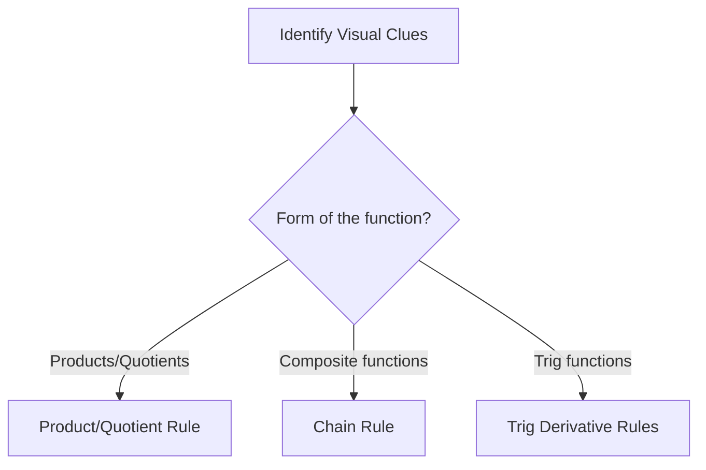

# {{title}} - GA Discussion Sheet

## Part A: Classification Matrix (~45 mins)
*Instructions: Before solving, classify the problem type, identify the identifying rule/theorem, and justify your classification using visual clues.*

| Problem | Classification | Identifying Rule/Theorem | Visual Clues / Justification |
| :---: | :--- | :--- | :--- |
| **1** | | | |
| **2** | | | |
| **3** | | | |
| **4** | | | |

---

### Problem 1
[Problem Statement]

> [!workspace] Student Practice Space
> 

> [!check]- Solution
> [Detailed step-by-step solution]

---

### Problem 2
[Problem Statement]

> [!workspace] Student Practice Space
> 

> [!check]- Solution
> [Detailed step-by-step solution]

---

### Problem 3
[Problem Statement]

> [!workspace] Student Practice Space
> 

> [!check]- Solution
> [Detailed step-by-step solution]

---

### Problem 4
[Problem Statement]

> [!workspace] Student Practice Space
> 

> [!check]- Solution
> [Detailed step-by-step solution]

---

## Part B: Next Week's Prerequisite Refresher (~30 mins)
*Instructions: Solve these prerequisite problems to prepare for next week's concepts.*

### Prerequisite Problem 1
[Statement of algebra, trigonometry, or calculus prerequisite problem]

> [!workspace] Student Practice Space
> 

> [!check]- Solution
> [Detailed step-by-step solution]

---

### Prerequisite Problem 2
[Statement of algebra, trigonometry, or calculus prerequisite problem]

> [!workspace] Student Practice Space
> 

> [!check]- Solution
> [Detailed step-by-step solution]
