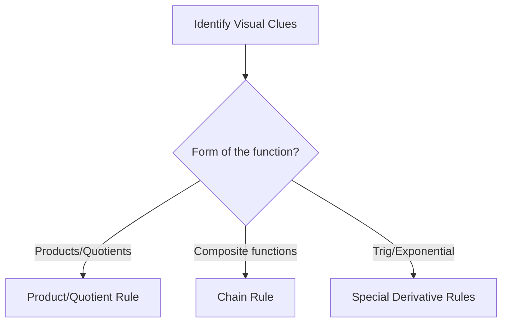

# Calc-1 Discussion 01 - 3 Types of Discontinuity

**Discussion Topics covered:** *3 Types of Discontinuity Graphically / Multiplying by the conjugate and algebraic manipulation*

## Part A: Classification Matrix (~45 mins)
*Instructions: Before solving, classify each problem, identify the governing rule or theorem, and justify your classification using visual clues.*

| Problem | Classification | Identifying Rule/Theorem | Visual Clues / Justification |
| :---: | :--- | :--- | :--- |
| **1** | | | |
| **2** | | | |
| **3** | | | |
| **4** | | | |

### Problem 1
Evaluate the limit graphically and algebraically: $\lim_{x \to 2} \frac{x^2 - 4}{x - 2}$. Classify any discontinuities.

> [!workspace] Student Practice Space
> 

> [!check]- Solution to Problem 1
> **Step 1: Simplify algebraically.**
> Notice that the numerator is a difference of squares:
> $$\frac{x^2 - 4}{x - 2} = \frac{(x - 2)(x + 2)}{x - 2} = x + 2 \quad \text{for } x \neq 2$$
> **Step 2: Evaluate the limit.**
> $$\lim_{x \to 2} (x + 2) = 4$$
> Since direct evaluation yields $0/0$ but the limit is finite, this is a **removable discontinuity (hole)** at $x = 2$.

---

### Problem 2
Evaluate the limit by multiplying by the conjugate: $\lim_{x \to 4} \frac{\sqrt{x} - 2}{x - 4}$.

> [!workspace] Student Practice Space
> 

> [!check]- Solution to Problem 2
> **Step 1: Multiply by the conjugate of the numerator.**
> $$\lim_{x \to 4} \frac{\sqrt{x} - 2}{x - 4} \cdot \frac{\sqrt{x} + 2}{\sqrt{x} + 2}$$
> $$= \lim_{x \to 4} \frac{x - 4}{(x - 4)(\sqrt{x} + 2)}$$
> **Step 2: Cancel common factors and evaluate.**
> $$= \lim_{x \to 4} \frac{1}{\sqrt{x} + 2} = \frac{1}{\sqrt{4} + 2} = \frac{1}{4}$$

---

### Problem 3
Find $k$ such that the function is continuous everywhere:
$$f(x) = \begin{cases} kx^2 - 1 & : x < 3 \\ 2kx + 5 & : x \geq 3 \end{cases}$$

> [!workspace] Student Practice Space
> 

> [!check]- Solution to Problem 3
> **Step 1: Set the left-hand limit equal to the right-hand limit at $x = 3$.**
> $$\lim_{x \to 3^-} f(x) = \lim_{x \to 3^-} (kx^2 - 1) = k(3)^2 - 1 = 9k - 1$$
> $$\lim_{x \to 3^+} f(x) = \lim_{x \to 3^+} (2kx + 5) = 2k(3) + 5 = 6k + 5$$
> For continuity, we need:
> $$9k - 1 = 6k + 5$$
> $$3k = 6 \implies k = 2$$

---

### Problem 4
Evaluate: $\lim_{x \to 0} \frac{\sqrt{x+9} - 3}{x}$.

> [!workspace] Student Practice Space
> 

> [!check]- Solution to Problem 4
> **Step 1: Multiply by the conjugate of the numerator.**
> $$\lim_{x \to 0} \frac{\sqrt{x+9} - 3}{x} \cdot \frac{\sqrt{x+9} + 3}{\sqrt{x+9} + 3}$$
> $$= \lim_{x \to 0} \frac{(x+9) - 9}{x(\sqrt{x+9} + 3)} = \lim_{x \to 0} \frac{x}{x(\sqrt{x+9} + 3)}$$
> $$= \lim_{x \to 0} \frac{1}{\sqrt{x+9} + 3} = \frac{1}{3 + 3} = \frac{1}{6}$$

---

## Part B: Next Week's Prerequisite Refresher (~30 mins)
*Instructions: Complete these problems to build fluency with the algebraic operations required for next week's new topics.*

### Prerequisite Problem 1
Factor the polynomial completely: $x^3 - 8$.

> [!workspace] Student Practice Space
> 

> [!check]- Solution to Prerequisite Problem 1
> Use the difference of cubes formula $a^3 - b^3 = (a-b)(a^2 + ab + b^2)$:
> $$x^3 - 8 = (x - 2)(x^2 + 2x + 4)$$

---

### Prerequisite Problem 2
Find the average rate of change of $f(x) = 2x^2 - x$ from $x=1$ to $x=3$.

> [!workspace] Student Practice Space
> 

> [!check]- Solution to Prerequisite Problem 2
> $$Average = \frac{f(3) - f(1)}{3 - 1}$$
> $$f(3) = 2(9) - 3 = 15$$
> $$f(1) = 2(1) - 1 = 1$$
> $$Average = \frac{15 - 1}{2} = 7$$
