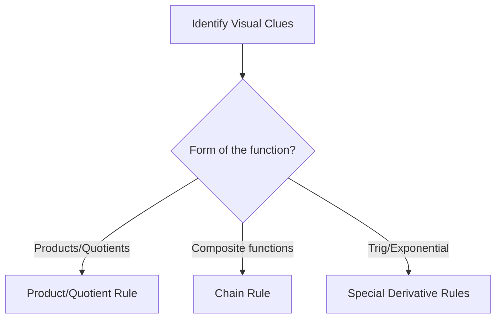

# Calc-1 Discussion 02 - Identify what Skill is

**Discussion Topics covered:** *Identify what Skill is needed to solve the limit / Definition of an asymptote and how to identify it*

## Part A: Classification Matrix (~45 mins)
*Instructions: Before solving, classify each problem, identify the governing rule or theorem, and justify your classification using visual clues.*

| Problem | Classification | Identifying Rule/Theorem | Visual Clues / Justification |
| :---: | :--- | :--- | :--- |
| **1** | | | |
| **2** | | | |
| **3** | | | |
| **4** | | | |

### Problem 1
Identify all vertical and horizontal asymptotes of $f(x) = \frac{2x^2 - 8}{x^2 - 9}$.

> [!workspace] Student Practice Space
> 

> [!check]- Solution to Problem 1
> **Vertical Asymptotes:** Set denominator to 0:
> $$x^2 - 9 = 0 \implies x = \pm 3$$
> Since the numerator is non-zero at these points, $x=3$ and $x=-3$ are vertical asymptotes.
> **Horizontal Asymptotes:** Find limits as $x \to \pm\infty$:
> $$\lim_{x \to \infty} \frac{2x^2 - 8}{x^2 - 9} = 2$$
> Therefore, $y = 2$ is the horizontal asymptote.

---

### Problem 2
Find the limit: $\lim_{x \to 3} \frac{x^2 - 2x - 3}{x - 3}$.

> [!workspace] Student Practice Space
> 

> [!check]- Solution to Problem 2
> **Step 1: Factor the numerator.**
> $$x^2 - 2x - 3 = (x - 3)(x + 1)$$
> **Step 2: Simplify and evaluate.**
> $$\lim_{x \to 3} \frac{(x-3)(x+1)}{x-3} = \lim_{x \to 3} (x + 1) = 4$$

---

### Problem 3
Find the horizontal asymptotes of $g(x) = \frac{\sqrt{4x^2 + 1}}{3x - 2}$.

> [!workspace] Student Practice Space
> 

> [!check]- Solution to Problem 3
> **Step 1: Evaluate limit as $x \to \infty$.**
> Divide by $x$:
> $$\lim_{x \to \infty} \frac{\sqrt{4x^2+1}}{3x-2} = \lim_{x \to \infty} \frac{\sqrt{4 + 1/x^2}}{3 - 2/x} = \frac{2}{3}$$
> **Step 2: Evaluate limit as $x \to -\infty$.**
> Recall that for $x < 0$, $x = -\sqrt{x^2}$:
> $$\lim_{x \to -\infty} \frac{\sqrt{4x^2+1}}{3x-2} = -\frac{2}{3}$$
> Horizontal asymptotes are $y = 2/3$ and $y = -2/3$.

---

### Problem 4
Determine why the limit DNE: $\lim_{x \to 0} \cos(1/x)$.

> [!workspace] Student Practice Space
> 

> [!check]- Solution to Problem 4
> As $x$ approaches $0$, the input $1/x$ approaches infinity. The cosine function oscillates infinitely between $-1$ and $1$ as its input approaches infinity. Because the function values do not settle near a single real number, the limit **does not exist (oscillating behavior)**.

---

## Part B: Next Week's Prerequisite Refresher (~30 mins)
*Instructions: Complete these problems to build fluency with the algebraic operations required for next week's new topics.*

### Prerequisite Problem 1
Expand and simplify: $\frac{(x+h)^2 - x^2}{h}$.

> [!workspace] Student Practice Space
> 

> [!check]- Solution to Prerequisite Problem 1
> $$\frac{(x^2 + 2xh + h^2) - x^2}{h} = \frac{2xh + h^2}{h} = \frac{h(2x + h)}{h} = 2x + h \quad (h \neq 0)$$

---

### Prerequisite Problem 2
Evaluate: $\lim_{h \to 0} (2x + h)$.

> [!workspace] Student Practice Space
> 

> [!check]- Solution to Prerequisite Problem 2
> Direct substitution yields:
> $$2x + 0 = 2x$$
