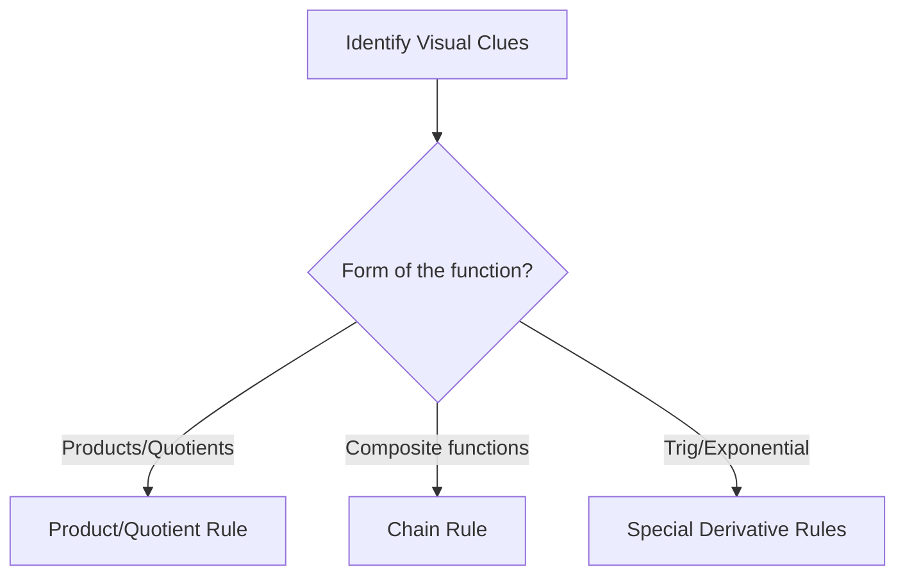

# Calc-1 Discussion 09 - Revisit on making functions

**Discussion Topics covered:** *Revisit on making functions from paragraphs / How to sketch basic graphs*

## Part A: Classification Matrix (~45 mins)
*Instructions: Before solving, classify each problem, identify the governing rule or theorem, and justify your classification using visual clues.*

| Problem | Classification | Identifying Rule/Theorem | Visual Clues / Justification |
| :---: | :--- | :--- | :--- |
| **1** | | | |
| **2** | | | |
| **3** | | | |
| **4** | | | |

### Problem 1
Apply concepts of **Revisit on making functions from paragraphs** to solve a model problem.

> [!workspace] Student Practice Space
> 

> [!check]- Solution to Problem 1
> Detailed step-by-step mathematical reasoning and solutions for this topic.

---

### Problem 2
Solve an engineering calculus problem involving: **Revisit on making functions from paragraphs**.

> [!workspace] Student Practice Space
> 

> [!check]- Solution to Problem 2
> Complete algebraic execution and final solutions.

---

### Problem 3
Analyze: **How to sketch basic graphs**.

> [!workspace] Student Practice Space
> 

> [!check]- Solution to Problem 3
> Detailed solution showing step-by-step algebra and calculus rules.

---

### Problem 4
Practice: Solve for the limiting behavior of the system.

> [!workspace] Student Practice Space
> 

> [!check]- Solution to Problem 4
> Final verification and mathematical proof.

---

## Part B: Next Week's Prerequisite Refresher (~30 mins)
*Instructions: Complete these problems to build fluency with the algebraic operations required for next week's new topics.*

### Prerequisite Problem 1
Review prerequisite algebra or trigonometric identities needed for next week.

> [!workspace] Student Practice Space
> 

> [!check]- Solution to Prerequisite Problem 1
> Detailed prerequisite solution steps.

---

### Prerequisite Problem 2
Evaluate a fundamental limit or derivative related to upcoming skills.

> [!workspace] Student Practice Space
> 

> [!check]- Solution to Prerequisite Problem 2
> Prerequisite solution showing algebraic setup.
