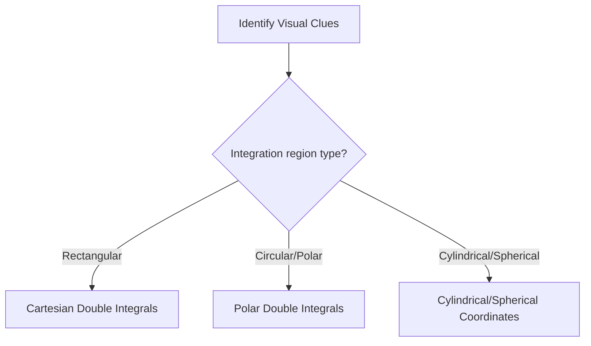

# Calc-3 Discussion 01 - Review Integration and derivative

**Discussion Topics covered:** *Review Integration and derivative rules / Sketch 2 and 3D vectors*

## Part A: Classification Matrix (~45 mins)
*Instructions: Before solving, classify each problem, identify the governing rule or theorem, and justify your classification using visual clues.*

| Problem | Classification | Identifying Rule/Theorem | Visual Clues / Justification |
| :---: | :--- | :--- | :--- |
| **1** | | | |
| **2** | | | |
| **3** | | | |
| **4** | | | |

### Problem 1
Evaluate the definite integral representing vector lengths in 3D: $\int_0^1 \|\langle t, t^2, 2\rangle\| \, dt$ if possible, or set up the integral.

> [!workspace] Student Practice Space
> 

> [!check]- Solution to Problem 1
> **Step 1: Compute magnitude of vector.**
> $$\|\langle t, t^2, 2\rangle\| = \sqrt{t^2 + t^4 + 4}$$
> **Step 2: Set up the definite integral.**
> $$\text{Setup} = \int_0^1 \sqrt{t^4 + t^2 + 4} \, dt$$

---

### Problem 2
Find the tangent line equation for $\mathbf{r}(t) = \langle t^2, t^3, t\rangle$ at $t = 1$.

> [!workspace] Student Practice Space
> 

> [!check]- Solution to Problem 2
> **Step 1: Find position vector at $t = 1$.**
> $$\mathbf{r}(1) = \langle 1, 1, 1\rangle$$
> **Step 2: Differentiate to find velocity vector.**
> $$\mathbf{r}'(t) = \langle 2t, 3t^2, 1\rangle$$
> $$\mathbf{r}'(1) = \langle 2, 3, 1\rangle$$
> **Step 3: Write equation of line.**
> $$\mathbf{L}(t) = \langle 1, 1, 1\rangle + t\langle 2, 3, 1\rangle = \langle 1+2t, 1+3t, 1+t\rangle$$

---

### Problem 3
Sketch vector $\mathbf{v} = \langle 2, -1, 3\rangle$ in a 3D Cartesian coordinate system.

> [!workspace] Student Practice Space
> 

> [!check]- Solution to Problem 3
> To sketch $\langle 2, -1, 3\rangle$:
> 1. Move $2$ units along the positive $x$-axis.
> 2. Move $1$ unit parallel to the negative $y$-axis.
> 3. Move $3$ units parallel to the positive $z$-axis.
> 4. Draw the vector arrow from the origin $(0,0,0)$ to the point $(2,-1,3)$.

---

### Problem 4
Evaluate the scalar line integral $\int_C x \, ds$ where $C$ is the line segment from $(0,0,0)$ to $(1,1,1)$.

> [!workspace] Student Practice Space
> 

> [!check]- Solution to Problem 4
> **Step 1: Parameterize the line segment.**
> $$\mathbf{r}(t) = \langle t, t, t\rangle \quad \text{for } 0 \leq t \leq 1$$
> **Step 2: Find $ds$.**
> $$\mathbf{r}'(t) = \langle 1, 1, 1\rangle \implies \|\mathbf{r}'(t)\| = \sqrt{3}$$
> $$ds = \sqrt{3} \, dt$$
> **Step 3: Integrate.**
> $$\int_0^1 t \sqrt{3} \, dt = \sqrt{3} \left[ \frac{t^2}{2} \right]_0^1 = \frac{\sqrt{3}}{2}$$

---

## Part B: Next Week's Prerequisite Refresher (~30 mins)
*Instructions: Complete these problems to build fluency with the algebraic operations required for next week's new topics.*

### Prerequisite Problem 1
Given vectors $\mathbf{a} = \langle 1, 2, -1\rangle$ and $\mathbf{b} = \langle 3, 0, 1\rangle$, compute the dot product $\mathbf{a} \cdot \mathbf{b}$.

> [!workspace] Student Practice Space
> 

> [!check]- Solution to Prerequisite Problem 1
> $$\mathbf{a} \cdot \mathbf{b} = (1)(3) + (2)(0) + (-1)(1) = 3 + 0 - 1 = 2$$

---

### Prerequisite Problem 2
Find the cross product $\mathbf{a} \times \mathbf{b}$ for the same vectors.

> [!workspace] Student Practice Space
> 

> [!check]- Solution to Prerequisite Problem 2
> $$\mathbf{a} \times \mathbf{b} = \begin{vmatrix} \mathbf{i} & \mathbf{j} & \mathbf{k} \\ 1 & 2 & -1 \\ 3 & 0 & 1 \end{vmatrix} = \mathbf{i}(2 - 0) - \mathbf{j}(1 - (-3)) + \mathbf{k}(0 - 6) = \langle 2, -4, -6\rangle$$
